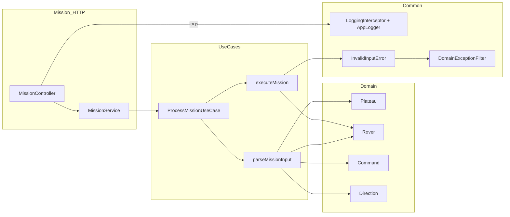
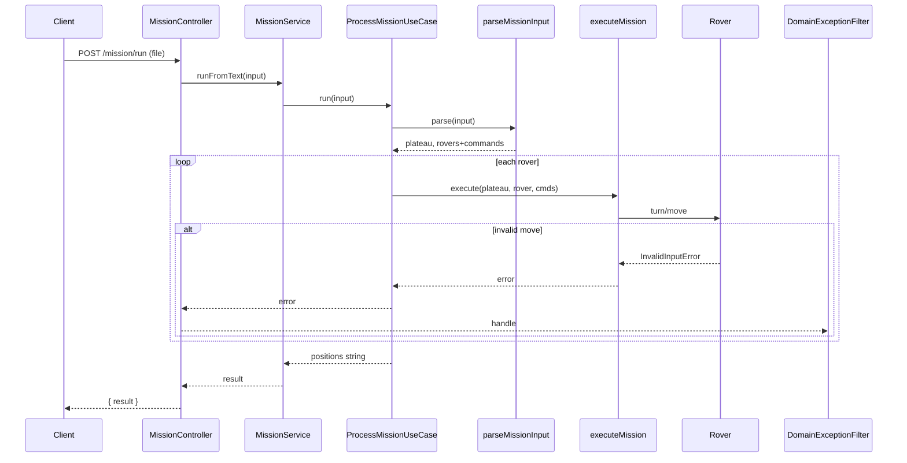

# 🚀 Foxbit Mission - Mars Rover Controller

Uma API REST para controlar missões de rovers em Marte, implementada com NestJS e seguindo princípios de Clean Architecture.

## 📋 Descrição

Este projeto implementa um sistema de controle para rovers em Marte, onde você pode:
- Definir as dimensões de um plateau (planalto)
- Posicionar rovers com coordenadas e direção inicial
- Executar comandos de movimento e rotação
- Obter as posições finais dos rovers após executar todos os comandos

## 🏗️ Arquitetura

O projeto segue os princípios de **Clean Architecture** com as seguintes camadas:

### Estrutura de Diretórios
```
src/
├── domain/           # Entidades e regras de negócio
├── usecases/         # Casos de uso da aplicação
├── mission/          # Módulo de missão (API)
├── common/           # Utilitários compartilhados
└── cli.ts            # Interface de linha de comando
```

### 📊 Diagramas de Arquitetura

#### 🏗️ Estrutura Geral do Sistema
Este diagrama mostra como as diferentes camadas se relacionam:



#### 🔄 Fluxo de Execução de uma Missão
Este diagrama mostra o fluxo completo desde a requisição HTTP até a resposta:



### Camadas da Arquitetura

1. **Domain Layer** (`src/domain/`)
   - `Rover`: Entidade que representa um rover com posição e direção
   - `Plateau`: Entidade que define os limites do planalto
   - `Direction`: Enum para direções (N, E, S, W)
   - `Command`: Enum para comandos (L, R, M)

2. **Use Cases** (`src/usecases/`)
   - `ProcessMissionUseCase`: Orquestra a execução da missão
   - `mission-input.parser.ts`: Parseia o input da missão
   - `mission-executor.ts`: Executa os comandos nos rovers

3. **API Layer** (`src/mission/`)
   - `MissionController`: Endpoint REST para upload de arquivos
   - `MissionService`: Serviço que conecta controller com use case

4. **Common** (`src/common/`)
   - Tratamento de erros customizados
   - Sistema de logging
   - Filtros de exceção
   - Interceptadores

## 🎯 Regras de Negócio

### 1. Formato do Input
O arquivo de entrada deve seguir este formato:
```
5 5
1 2 N
LMLMLMLMM
3 3 E
MMRMMRMRRM
```

**Estrutura:**
- **Linha 1**: Dimensões do plateau (X Y)
- **Linhas pares**: Posição inicial do rover (X Y D)
- **Linhas ímpares**: Comandos do rover (L, R, M)

### 2. Comandos Disponíveis
- **L**: Girar 90° para a esquerda
- **R**: Girar 90° para a direita  
- **M**: Mover uma posição na direção atual

### 3. Direções
- **N**: Norte (Y aumenta)
- **E**: Leste (X aumenta)
- **S**: Sul (Y diminui)
- **W**: Oeste (X diminui)

### 4. Validações
- Plateau deve ter dimensões válidas (≥ 0)
- Rovers devem iniciar dentro dos limites do plateau
- Comandos devem ser válidos (L, R, M)
- Movimentos não podem sair dos limites do plateau
- Input deve ter pelo menos 3 linhas

## 🚨 Tratamento de Erros

### Tipos de Erro
- `InvalidInputError`: Para entradas inválidas
- `BadRequestException`: Para requisições HTTP inválidas

### Mensagens de Erro
- Entrada muito curta
- Coordenadas do plateau inválidas
- Posição do rover inválida
- Comandos inválidos
- Rover inicial fora dos limites
- Movimento que sairia do plateau

## 🧪 Testes

### Cobertura de Testes
O projeto mantém uma cobertura mínima de **88%** para:
- Branches
- Functions  
- Lines
- Statements

### Tipos de Teste
- **Unit Tests**: Testes unitários para cada entidade e use case
- **Integration Tests**: Testes de integração entre camadas
- **Fuzz Tests**: Testes de propriedades com fast-check
- **E2E Tests**: Testes end-to-end da API

### Executar Testes
```bash
# Testes unitários
yarn test

# Testes em modo watch
yarn test:watch

# Cobertura de testes
yarn test:cov

# Testes E2E
yarn test:e2e

# Testes com debug
yarn test:debug
```

## 🚀 Como Executar

### Pré-requisitos
- Node.js 18+
- Yarn ou npm

### Instalação
```bash
# Instalar dependências
yarn install

# Build do projeto
yarn build
```

### Execução da API
```bash
# Desenvolvimento
yarn start:dev

# Produção
yarn start:prod

# Debug
yarn start:debug
```

A API estará disponível em `http://localhost:3002`

### Interface de Linha de Comando
```bash
# Executar missão via CLI
yarn cli --file path/to/input.txt
# ou
yarn cli path/to/input.txt
```

## 📚 Documentação

### Documentação da API
- **Swagger UI**: Acesse `http://localhost:3002/api-docs` para documentação interativa da API
- **Endpoints**: 
  - **POST** `/mission/run` - Executa missão a partir de arquivo

### 📊 Diagramas de Arquitetura
Os diagramas abaixo mostram a estrutura e fluxo do sistema. Como o GitHub renderiza automaticamente diagramas Mermaid, você pode visualizá-los diretamente aqui:

- **Diagrama de Arquitetura**: Estrutura geral do sistema e relacionamentos entre camadas
- **Diagrama de Sequência**: Fluxo completo de execução de uma missão

> 💡 **Dica**: Os diagramas Mermaid são renderizados automaticamente no GitHub. Para editar ou visualizar em outras ferramentas, consulte a pasta [`docs/`](./docs/README.md).

## 🔧 Scripts Disponíveis

```bash
# Desenvolvimento
yarn start:dev      # Modo watch
yarn start:debug    # Modo debug

# Build
yarn build          # Compilar TypeScript

# Qualidade de Código
yarn lint           # ESLint
yarn format         # Prettier

# Testes
yarn test           # Jest
yarn test:cov       # Cobertura
yarn test:e2e       # E2E

# CLI
yarn cli            # Interface linha de comando
```

## 🏗️ Tecnologias Utilizadas

- **Framework**: NestJS 10
- **Linguagem**: TypeScript 5
- **Testes**: Jest + fast-check
- **Validação**: class-validator + class-transformer
- **Documentação**: Swagger/OpenAPI
- **Linting**: ESLint + Prettier
- **Git Hooks**: Husky + commitlint

## 📁 Exemplo de Uso

### Arquivo de Entrada (`mission.txt`)
```
5 5
1 2 N
LMLMLMLMM
3 3 E
MMRMMRMRRM
```

### Execução via CLI
```bash
yarn cli mission.txt
```

### Saída Esperada
```
1 3 N
5 1 E
```

### Execução via API
```bash
curl -X POST http://localhost:3002/mission/run \
  -F "file=@mission.txt"
```
