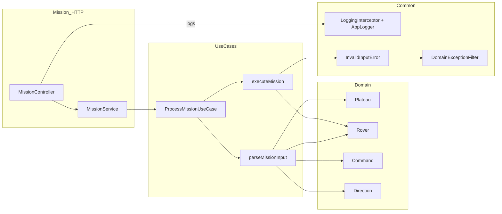
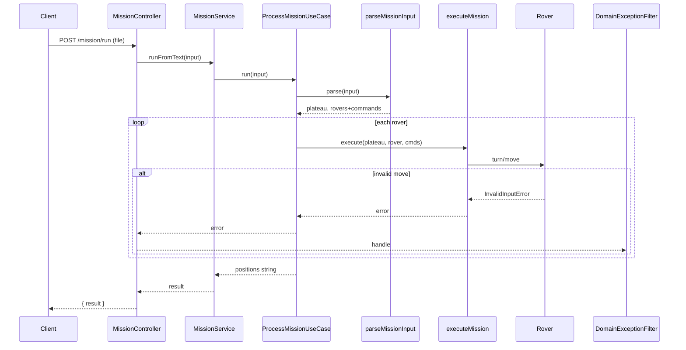

# 📊 Diagramas do Sistema

Esta pasta contém os diagramas Mermaid que ilustram a arquitetura e fluxo do sistema Foxbit Mission.

## 🏗️ Diagrama de Arquitetura

**Arquivo**: `architecture.mmd`

Este diagrama mostra a estrutura geral do sistema e como as diferentes camadas se relacionam:

## 🔄 Diagrama de Sequência

**Arquivo**: `sequence.mmd`

Este diagrama mostra o fluxo de execução de uma missão, desde a requisição HTTP até a resposta:

## 📝 Descrição dos Componentes

### Mission HTTP Layer
- **MissionController**: Recebe requisições HTTP e gerencia uploads de arquivo
- **MissionService**: Conecta o controller com os casos de uso

### Use Cases Layer
- **ProcessMissionUseCase**: Orquestra todo o processo da missão
- **parseMissionInput**: Converte texto de entrada em objetos estruturados
- **executeMission**: Executa comandos em um rover específico

### Domain Layer
- **Plateau**: Define os limites e valida posições
- **Rover**: Representa um rover com posição, direção e comandos
- **Command**: Enumera os comandos disponíveis (L, R, M)
- **Direction**: Enumera as direções (N, E, S, W)

### Common Layer
- **DomainExceptionFilter**: Captura e trata erros de domínio
- **LoggingInterceptor + AppLogger**: Sistema de logging centralizado
- **InvalidInputError**: Erro customizado para entradas inválidas

## 🔍 Como Interpretar os Diagramas

### Fluxo de Arquitetura
1. **Entrada**: Client → Controller → Service → UseCase
2. **Processamento**: UseCase → Parser → Domain Objects
3. **Execução**: UseCase → Executor → Rover
4. **Saída**: Rover → UseCase → Service → Controller → Client

### Fluxo de Sequência
1. **Upload**: Cliente envia arquivo via POST
2. **Parse**: Sistema converte texto em objetos estruturados
3. **Execução**: Comandos são executados em cada rover
4. **Validação**: Movimentos inválidos geram erros
5. **Resultado**: Posições finais são retornadas

## 🚀 Próximos Passos

Para adicionar novos diagramas:
1. Crie um arquivo `.mmd` com sintaxe Mermaid
2. Adicione uma descrição neste README
3. Inclua o diagrama renderizado usando blocos de código
4. Atualize a documentação principal se necessário

## 📊 Diagrama de CI/CD

**Arquivo**: `ci-pipeline.mmd`

Este diagrama mostra o fluxo completo de Integração Contínua implementado no projeto:

```mermaid
flowchart TD
    subgraph "Developer Workflow"
        A[Desenvolvedor faz alterações] --> B[git add .]
        B --> C[git commit -m 'feat: nova funcionalidade']
        C --> D[git push origin main]
    end

    subgraph "GitHub Actions CI"
        E[Trigger: push/PR para main] --> F[Checkout código]
        F --> G[Setup Node.js 20 + Yarn cache]
        G --> H[Instalar dependências]
        H --> I[Build do projeto]
        I --> J[Executar testes com cobertura]
        
        J --> K{Testes passaram?}
        K -->|✅ Sim| L[Build e testes OK]
        K -->|❌ Não| M[❌ CI falhou]
        
        L --> N[✅ CI passou]
    end

    subgraph "Code Quality Tools"
        O[Commitizen] --> P[Conventional Commits]
        Q[ESLint + Prettier] --> R[Padrões de código]
        S[Husky] --> T[Git hooks]
    end

    subgraph "Quality Gates"
        U[Cobertura mínima: 88%] --> V[Linting passa]
        V --> W[Build compila]
        W --> X[Testes passam]
    end

    style A fill:#e1f5fe
    style N fill:#c8e6c9
    style M fill:#ffcdd2
    style U fill:#fff3e0
```

### Descrição dos Componentes do CI

#### Developer Workflow
- **Alterações**: Desenvolvedor modifica o código
- **Commit**: Usa padrões convencionais (feat:, fix:, docs:, etc.)
- **Push**: Envia para a branch main

#### GitHub Actions CI
- **Trigger**: Executa automaticamente em push/PR para main
- **Setup**: Configura ambiente Node.js 20 com cache Yarn
- **Build**: Compila o projeto TypeScript
- **Testes**: Executa suite de testes com cobertura mínima

#### Code Quality Tools
- **Commitizen**: Padrões de commit convencionais
- **ESLint + Prettier**: Linting e formatação de código
- **Husky**: Git hooks para validação automática

#### Quality Gates
- **Cobertura**: Mínimo de 88% para branches, functions, lines e statements
- **Linting**: Código deve passar nas regras do ESLint
- **Build**: Projeto deve compilar sem erros
- **Testes**: Todos os testes devem passar 